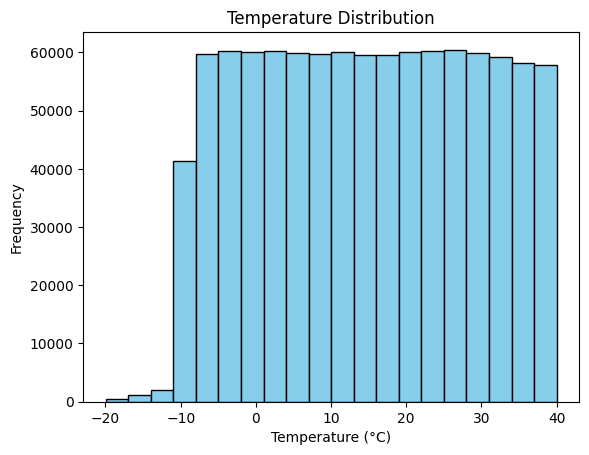
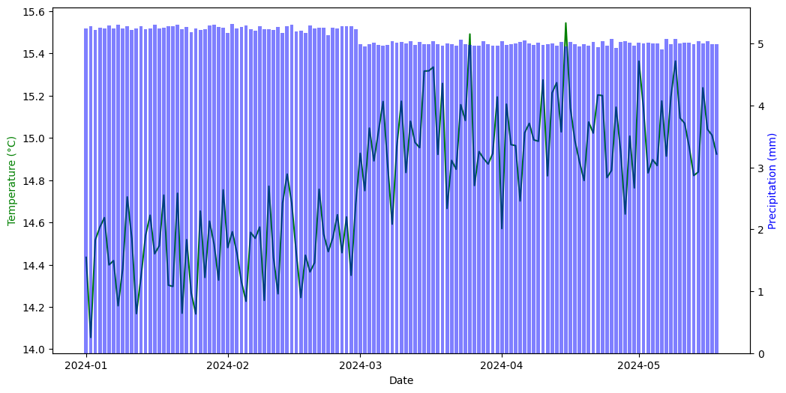

# Weather Analysis Project

## 10835225 Mingi Song

This project is a Python-based application for analyzing weather data from a CSV file. It includes features for statistical calculations, data visualization, and basic predictive modeling using machine learning.

---

## Features

- **CSV Data Analysis**:
  - Reads weather datasets with various locations and timestamps.
  - Calculates descriptive statistics: mean, median, mode, and range.
- **Visualizations**:
  - Temperature Distribution (Histogram).
  - Daily Average Temperature and Precipitation (Line and Bar Chart).
- **Basic Predictive Modeling**:
  - Predicts temperature values using a simple machine learning model (Linear Regression).
  - Includes additional features such as time-based analysis and location encoding.
- **Additional Functionalities**:
  - Summarize data by location.
  - Identify extreme weather events (hottest and coldest days).
  - Save analysis results to a text file.

---

## Project Structure

```plaintext
weather_analysis_project/
├── app.py                 # Flask app (if applicable for web version)
├── module.py              # Database and utility functions
├── weather_analysis.py    # Weather data analysis module
├── static/
│   ├── temperature_distribution.png  # Generated histogram
│   ├── daily_avg_temp_precip.png     # Line and bar chart visualization
│   ├── actual_vs_predicted.png       # Model evaluation graph
├── weather_data.csv       # Example CSV data
├── weather_analysis.log   # Log file for debugging
├── weather_summary.txt    # Example summary output
└── README.md              # Documentation (this file)
```

---

## Requirements

Ensure you have the following installed:
- Python 3.7 or higher
- pip (Python package manager)

Install required Python libraries:
```bash
pip install flask flask-sqlalchemy pandas matplotlib scikit-learn
```

---

## How to Run

1. **Prepare the Data**:
   - Place your CSV file in the project directory.
   - Ensure the CSV contains the following columns:
     - `Location`
     - `Date_Time`
     - `Temperature_C`
     - `Humidity_pct`
     - `Precipitation_mm`
     - `Wind_Speed_kmh`

2. **Run the Application**:
   - Open a terminal in the project directory.
   - Execute the Flask app:
     ```bash
     python app.py
     ```
   - Open the browser at `http://127.0.0.1:5000/`.
   - Execute machine learning:    
   ```bash
     python weather_analysis.py
     ```

3. **View Results**:
   - Upload your CSV file and view the analysis results, including visualizations and a paginated data table.

---

## How It Works

1. **Data Fetching and Cleaning**:
   - Data is loaded from a CSV file and cleaned.
   - The `Location` column is encoded into numeric values for use in modeling.
   - Time-based features (e.g., `month` and `season`) are added to enhance analysis.

2. **Data Analysis**:
   - The system calculates statistics such as:
     - Mean, Median, Mode, and Range of temperatures.
     - Extreme weather events (e.g., hottest and coldest days) are identified.

3. **Visualizations**:
   - **Temperature Distribution**:
     - A histogram showing the frequency of temperature ranges.
   - **Daily Average Temperature and Precipitation**:
     - A combination of a line chart (temperature) and bar chart (precipitation).

---

## Functional Overview

### Core Analysis Features

1. **Data Cleaning and Feature Engineering**:
   - Cleans the dataset by handling missing values.
   - Encodes the `Location` column into numeric values.
   - Extracts time-based features like `month` and `season`.

2. **Statistical Analysis**:
   - Calculates key statistics like mean, median, mode, and range of temperature.
   - Summarizes weather data for each location.
   - Identifies extreme weather events, such as the hottest and coldest days.

3. **Visualizations**:
   - **Temperature Distribution Histogram**:
     - Provides insight into the spread of temperature data.
   - **Daily Average Temperature and Precipitation Chart**:
     - Combines a line chart (temperature) and bar chart (precipitation).

4. **Basic Predictive Modeling**:
   - A `LinearRegression` model predicts temperature based on:
     - Humidity, precipitation, wind speed, and time-based features.
   - Evaluates the model with:
     - **MSE (Mean Squared Error)**: Measures prediction error.
     - **R² Score**: Indicates how well the model explains data variance.
   - Generates a scatter plot comparing Actual vs Predicted values.

---

## Example Output

### Statistical Summary
```plaintext
Mean Temperature: 14.78 °C
Median Temperature: 14.78 °C
Mode Temperature: -19.97 °C
Temperature Range: 59.97 °C
```


### Weather Summaries by Location
```plaintext
Location-wise Weather Summary:
        Location  avg_temp  avg_precip
0       Chicago      12.35      3.45
1        Dallas      15.24      2.89
2       Houston      20.87      4.23
3         Miami      24.35      6.12
```
### Predictive Modeling
```plaintext
Model Evaluation for Chicago:
Mean Squared Error (MSE): 208.80
R-squared (R²): -0.004
Actual vs Predicted:
Actual: 15.96, Predicted: 14.80
Actual: 28.86, Predicted: 15.95
Actual: 37.19, Predicted: 15.86
...
Graph saved at: static/actual_vs_predicted.png
```
---

## Code Explanation

### app.py
- **Flask Routes**:
  - `/`: Main page for uploading files and displaying results.
  - `/analyze`: Handles file uploads and triggers data analysis.

### module.py
- Contains the `WeatherData` SQLAlchemy model and utilities for handling the SQLite database.

### weather_analysis.py
- Performs statistical analysis and generates visualizations:
  - `fetch_data`: Loads and cleans CSV data.
  - `calculate_statistics`: Computes descriptive statistics.
  - `plot_temperature_distribution`: Creates a histogram.
  - `plot_daily_avg_temp_and_precip`: Generates a line/bar chart.

---

## Example Output

### Statistical Summary
```plaintext
Mean Temperature: 14.78 °C
Median Temperature: 14.78 °C
Mode Temperature: -19.97 °C
Temperature Range: 59.97 °C
```

### Visualizations
- **Temperature Distribution**:
  
- **Daily Average Temperature and Precipitation**:
  

---

## Known Issues

- **Large Datasets**:
  - Processing very large files (e.g., 2 million rows) can cause delays.
  - Use the paginated view to display results efficiently.
- **Permission Errors**:
  - Temporary files may cause issues on Windows. Ensure no other process is using the file.
- **High MSE in Predictive Modeling**:
  - The model's accuracy is limited due to weak correlations between features and temperature.
  - Consider exploring additional features or using advanced models like ```RandomForestRegressor``` or ```XGBoost```.
---

## Logging

- All operations are logged to `weather_analysis.log` for debugging.
- Includes errors (e.g., missing files, invalid data) and successful operations.

---

## Additional Notes

- The application uses the `Agg` backend for Matplotlib to ensure compatibility with Flask's non-interactive environment.
- SQLite database is automatically created in the project directory.

---

## Acknowledgments

- Developed as part of CS3270 coursework.
- Special thanks to [Flask](https://flask.palletsprojects.com/) and [Matplotlib](https://matplotlib.org/) communities.

